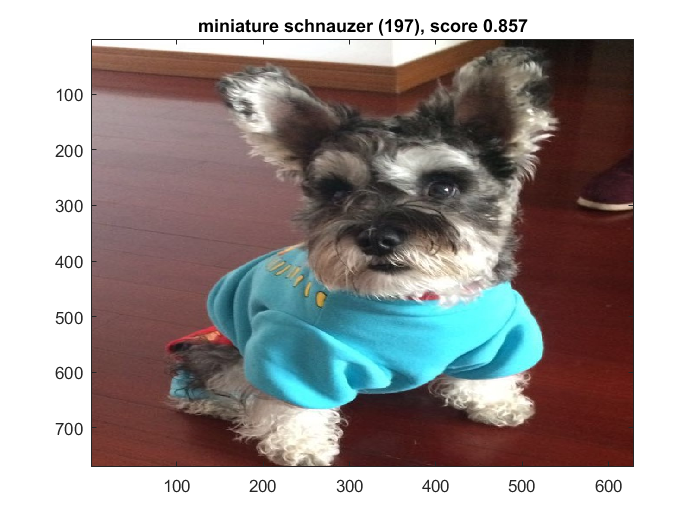
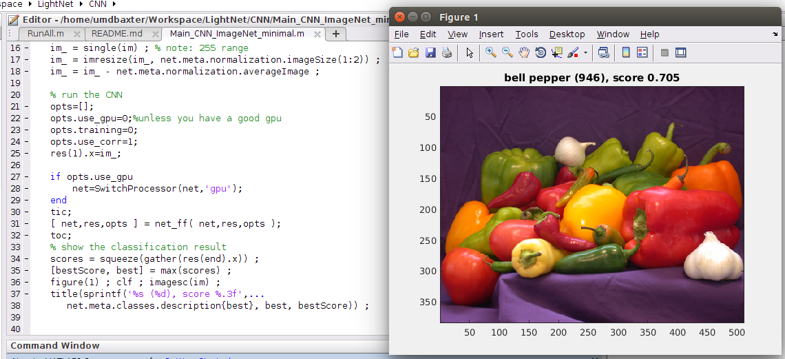

# LightNet: A Versatile, Standalone Matlab-based Environment for Deep Learning

Chengxi Ye, Chen Zhao, Yezhou Yang, Cornelia Fermüller, and Yiannis Aloimonos. 2016. LightNet: A Versatile, Standalone Matlab-based Environment for Deep Learning. In Proceedings of the 2016 ACM on Multimedia Conference (MM '16). Amsterdam, The Netherlands, 1156-1159. (http://dl.acm.org/citation.cfm?id=2973791)

LightNet is a lightweight, versatile and purely Matlab-based deep learning framework. The aim of the design is to provide an easy-to-understand, easy-to-use and efficient computational platform for deep learning research. The implemented framework supports major deep learning architectures such as the Multilayer Perceptron Networks (MLP), Convolutional Neural Networks (CNN) and Recurrent Neural Networks (RNN). LightNet supports both CPU and GPU for computation and the switch between them is straightforward. Different applications in computer vision, natural language processing and robotics are demonstrated as experiments.

## How to use LightNet

Install the latest Matlab on a computer, and run the RunAll.m Matlab script. The computation can be accelerated by using an Nvidia GPU. And can be further accelerated by installing the Neural Network Toolbox Add-on.
 
Read the latest documentation here:  
http://arxiv.org/abs/1605.02766 
and the attached tutorial slides.
Have fun!  

## Recent updates

-  CUDNN is supported by installing Neural Network Toolbox from Mathworks. The convolutional network training is over 10x faster than the previous release! The current version can process 10,000 CIFAR-10 images per second in the training.

LightNet supports using pretrained ImageNet network models. 

Check CNN/Main_CNN_ImageNet_Minimal()

An example recognition using imagenet-vgg-f pretrained net:

## Major functions in LightNet
  
####network related:
Main_Template: a template script used to train CNN and MLP networks.  
net_bp: implementation of the back propagation process which is used in CNN and MLP networks.  
net_ff: implementation of the feed forward process which is used in CNN and MLP networks.  
test_net: running the network in the testing mode to evaluate the current parameters.  
train_net: running the network in the training mode to evaluate and calculate the loss and gradients.  
TrainingScript: a training template for CNN and MLP networks.  
net_init*: how to initialize a neural network.  
  
####layers:
bnorm: implementation of the batch normalization layer.  
conv_layer_2d: implementation of the convolution layer. (CUDNN enabled)  
dropout: implementation of the dropout layer.  
linear_layer: implementation of (fully-connected) linear layer. (CUDNN enabled)   
lrn: implementation of the local response normalization layer. (CUDNN enabled)  
maxpool: implementation of the max-pooling layer. (CUDNN enabled)  
relu: implementation of the rectified linear unit function.  
sigmoid_ln: implementation of the sigmoid layer.  
tanh_ln: implementation of the tanh layer.  
  
####loss functions:
softmax: implementation of the softmax layer.  
softmaxlogloss: implementation of the softmax log loss layer .  
  
####optimization related:
adagrad: implementation of the Adagrad algorithm.  
adam: implementation of the Adam algorithm.  
rmsprop: implementation of the RMSProp algorithm.  
select_learning_rate: implementation of the Selective-SGD algorithm that automatically selects the optimal learning rate at the beginning or in the middle of the training.  
sgd: implementation of the stochastic gradient descent algorithm with momentum.  
  
####utility functions:
generate_output_filename: generate output filename based on the current parameter settings.  
im2col_ln: customized im2col function used in the pooling layer.  
pad_data: a padding layer which is used in CNN.  
SwitchProcessor: a switch function between CPU and GPU.  

## How to accelerate LightNet

Nvidia CUDNN can be used to calculate convolutions. 

1. You will need to install the Neural Network Toolbox from Mathworks. Make sure you can run it properly. (Ref to our tutorial slides.)  
2. Set opts.use_nntoolbox=1 in the main tesing script.  
